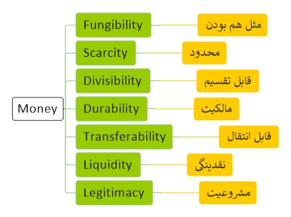
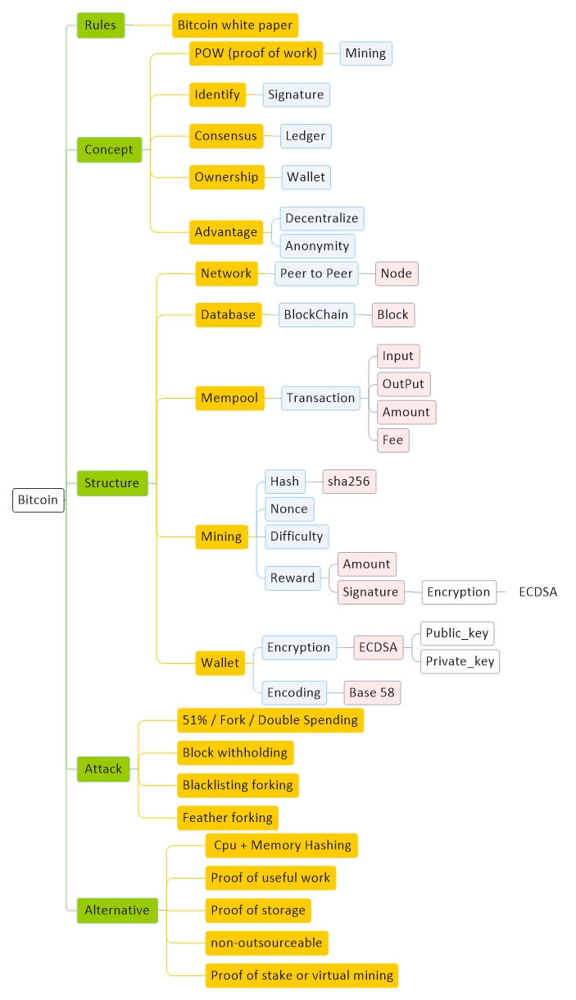
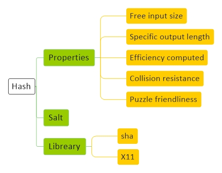
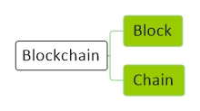

# [Crypto Currency Diagram](CryptoCurrency.md)
[Diagram](CryptoCurrency-Diagram.md) | 
[Bitcoin](CryptoCurrency-Bitcoin.md) |
[Hash](CryptoCurrency-Hash.md) |
[Encryption](CryptoCurrency-Encryption.md) |
[Blockchain](CryptoCurrency-Blockchain.md) |
[Ethereum](CryptoCurrency-Ethereum.md)

<a href="#general">General</a> - 
<a href="#money">Money</a> - 
<a href="#bitcoin">Bitcoin</a> -
<a href="#hashing">Hashing</a> -
<a href="#signature">Signature</a> - 
<a href="#blockchain">Blockchain</a> - 
 

## General

## Money

## Bitcoin

## Hashing

## Signature

## Blockchain

