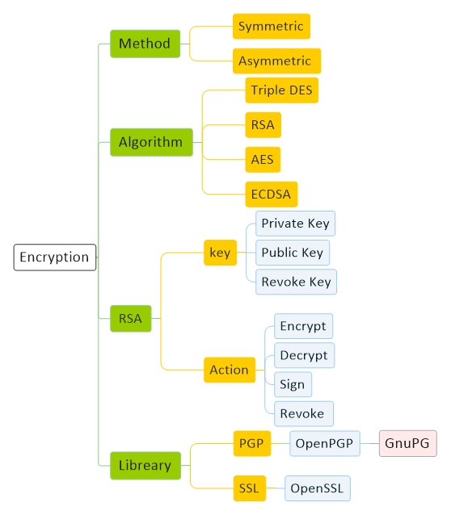

# [Crypto Currency Encryption ](CryptoCurrency.md)
[Diagram](CryptoCurrency-Diagram.md) | 
[Bitcoin](CryptoCurrency-Bitcoin.md) |
[Hash](CryptoCurrency-Hash.md) |
[Encryption](CryptoCurrency-Encryption.md) |
[Blockchain](CryptoCurrency-Blockchain.md) |
[Ethereum](CryptoCurrency-Ethereum.md)

<a href="#diagram">Diagram</a> - 
<a href="#resource">Resource</a> - 
<a href="#method">Method</a> - 
<a href="#algorithm">Algorithm</a> - 
<a href="#structure">Structure</a> - 
<a href="#libreary">Libreary</a> - 
<a href="#command">Command</a> - 
<a href="#note">Note</a> - 
<a href="#question">Question</a> 

## Diagram

## Resource

#### General

<a href="https://en.wikipedia.org/wiki/Pretty_Good_Privacy" target="_blank">PGP</a> - 
<a href="https://www.openpgp.org/" target="_blank">OpenPGP</a> - 
<a href="https://gnupg.org/" target="_blank">GnuPG</a>

#### Tutorial

<a href="https://www.devdungeon.com/content/gpg-tutorial" target="_blank">devdungeon</a>

## Method

Symmetric

Asymmetric

## Algorithm

Triple DES

RSA

AES

ECDSA

## Structure

#### Key

Private Key

Public Key

Revoke Key

#### Action

Encrypt

Decrypt

Sign

Revoke 

## Libreary

PGP

OpenPGP

GnuPG 

## Command

#### Generate

    gpg --full-generate-key

#### List
    gpg --list-keys
    gpg --list-secret-keys

#### Delete

    gpg --delete-key morteza
    gpg --delete-secret-key morteza

#### Import

    gpg --import public_key
    gpg --import private_key

#### Export

    gpg --export morteza > public_key
    gpg --export --armor morteza > public_key.asc

    gpg --export-secret-keys morteza > private_key
    gpg --export-secret-keys --armor morteza > private_key.asc

#### Encrypted / Decrypted

    gpg --out file.encrypted --recipient morteza --encrypt file.original
    gpg --out file.decrypted --decrypt file.encrypted

#### Signature
    gpg --local-user morteza --detach-sign --sign --armor --output file.sign file.original
    gpg --verify file.sign file.original
    

#### Revoke

    gpg --out file.revoke --gen-revoke morteza

## Note

#### 
روش : Method

متقارن : Symmetric

 در این روش برای رمز کردن اطلاعات و همچنین باز کردن اطلاعات از یک کلید استفاده می‌‌شود

نامتقارن : Asymmetric

در این روش از یک کلید برای رمز کردن اطلاعات و از یک کلید دیگر برای باز کردن اطلاعات استفاده می‌‌شود 

#### 
Algorithm : RSA

رمزنگاری : Encryption

در این سیستم ما ۲ تا کلید داریم، یکی‌ برای رمزنگاری اطلاعات(Public Key) و یکی‌ برای رمزگشایی اطلاعات (Private Key)

فرض کنید ۵ نفر می‌خواهد برای ما به صورت رمزشده اطلاعاتی‌ بفرستند، باید چی‌ کار کنیم ؟

ما (Public Key) را در اختیار همهٔ آنها  قرار میدهیم و آنها با (Public Key) اطلاعاتی‌ را رمزنگاری می‌‌کنند، اطلاعات رمز شده را فقط کسی‌ میتواند رمزگشایی کند که (Private Key) را در اختیار داشته باشد و اون شخص کسی‌ نیست جز خود ما 

حالا از کجا بفهمیم که هر پیغام برای چه کسی‌ است ؟

امضا : Signature

حالا اگر هر کسی‌ بتونه پیغام خودش رو امضا کنه و ما بتونیم امضای هر کسی‌ رو برسی‌ کنیم، میتونیم بفهمیم هر پیغام برای چه کسی‌ هست
پس با استفاده از یک فانکشن که Private_key و Data رو به عنوان ورودی میگیره و یک امضا برای اون دیتا درست می‌کنه، می‌تونیم دیتای خود را امضا کنیم و امضا رو در اختیار دیگران قرار می دهیم تا بررسی کنن اطلاعاتی که بدستشون میرسه از طرف ما هست یا نه

اینجوری امضا می کنیم : MySign = Sign(private_key, data)

اینجوری امضا رو چک می کنیم : ValidateSign = Validate(public_key, MySign, data )

## Question

1 -
 
2 - 
 
3 - 
 
4 - 
 
5 - 