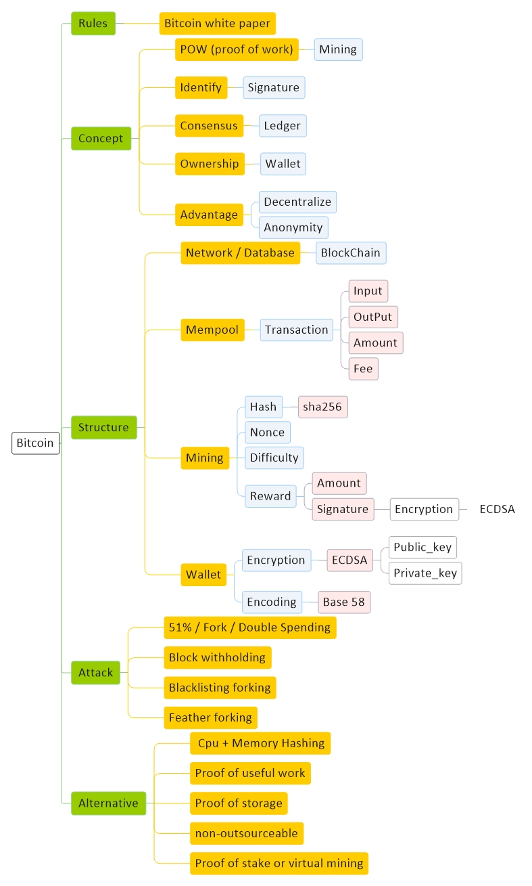

# [Crypto Currency Basic](CryptoCurrency.md)
[Diagram](CryptoCurrency-Diagram.md) | 
[Bitcoin](CryptoCurrency-Bitcoin.md) |
[Hash](CryptoCurrency-Hash.md) |
[Signature](CryptoCurrency-Signature.md) |
[Blockchain](CryptoCurrency-Blockchain.md) |
[Ethereum](CryptoCurrency-Ethereum.md)

<a href="#resource">Resource</a> - 
<a href="#idioms">Idioms</a> -
<a href="#structure">Structure</a> - 
<a href="#concept">Concept</a> -
<a href="#note">Note</a> - 
<a href="#question">Question</a>

## Resource

#### General

<a href="https://bitcoin.org/en/" target="_blank">bitcoin</a> - 
<a href="https://github.com/bitcoin" target="_blank">github</a> - 
<a href="https://www.blockchain.com/" target="_blank">blockchain</a> - 
<a href="https://coinmarketcap.com/" target="_blank">Coinmarketcap</a> - 
<a href="https://jochen-hoenicke.de/queue/#BTC,6m,weight" target="_blank">jochen</a> - 
<a href="https://www.viabtc.com/" target="_blank">viabtc</a> - 

#### Tutorial

<a target="_blank" href="https://www.youtube.com/watch?v=y38dHYUqkPQ&list=PL-tKrPVkKKE1gLxAL-56H-XR-fTapqofC&index=5">Jadi</a> -
<a target="_blank" href="https://docs.google.com/presentation/d/1sqgx2gQE0G2UXa4MpOYNPyDkFPsjuBZuKLBhAtfBXC0/edit#slide=id.g5d7a56f4a0_1_0">Jadi Slide</a> -
<a target="_blank" href="https://maktabkhooneh.org/course/%D8%A8%D9%84%D8%A7%DA%A9-%DA%86%DB%8C%D9%86-%D8%A8%D9%87-%D8%B2%D8%A8%D8%A7%D9%86-%D8%B3%D8%A7%D8%AF%D9%87-mk976/#information">Jadi maktabkhoone</a> - 
<a target="_blank" href="https://maktabkhooneh.org/course/%D8%A2%D9%85%D9%88%D8%B2%D8%B4-%D8%B1%D8%A7%DB%8C%DA%AF%D8%A7%D9%86-%D8%A8%D9%84%D8%A7%DA%A9%DA%86%DB%8C%D9%86-%D8%B1%D9%85%D8%B2%D8%A7%D8%B1%D8%B2%D9%87%D8%A7-mk667/">Mohsen Bahramgiri</a> -
<a target="_blank" href="https://bitnodes.io/">bitnodes</a> -

#### Character

Satoshi Nakamoto - Warren Edward Buffett

## Idioms

<table><tbody>
<tr><td colspan="2" align="center" bgcolor="D1ECCF">Idioms</td></tr>
<tr>
<td rowspan="1" align="center">Exchange</td>
<td align="center">تبادل</td>
</tr>
<tr>
<td rowspan="1" align="center">Fiat</td>
<td align="center">همین پولهای رایج</td>
</tr>
<tr>
<td rowspan="1" align="center">Double Spending</td>
<td align="center">دو بار خرج کردن</td>
</tr>
<tr>
<td rowspan="1" align="center">Ledger</td>
<td align="center">دفتر لاگ معاملات</td>
</tr>
<tr>
<td rowspan="1" align="center">Rules</td>
<td align="center">قوانین</td>
</tr>
<tr>
<td rowspan="1" align="center">Decentralize</td>
<td align="center">غیر متمرکر</td>
</tr>
<tr>
<td rowspan="1" align="center">Consensus</td>
<td align="center">اجماع</td>
</tr>
<tr>
<td rowspan="1" align="center">FPGA</td>
<td align="center">دستگاهایی که فقط یک کار انجام میدهند</td>
</tr>
<tr>
<td rowspan="1" align="center">ASIC</td>
<td align="center">دستگاهایی که فقط یک کار انجام میدهند</td>
</tr>
<tr>
<td rowspan="1" align="center">Fungibility</td>
<td align="center">دو تا از اون مثل هم باشند</td>
</tr>
<tr>
<td rowspan="1" align="center">Scarcity</td>
<td align="center">محدود</td>
</tr>
<tr>
<td rowspan="1" align="center">Divisibility</td>
<td align="center">قابل تقسیم</td>
</tr>
<tr>
<td rowspan="1" align="center">Durability</td>
<td align="center">مالکیت</td>
</tr>
<tr>
<td rowspan="1" align="center">Transferability</td>
<td align="center">قابل انتقال</td>
</tr>
<tr>
<td rowspan="1" align="center">Liquidity</td>
<td align="center">نقدینگی</td>
</tr>
<tr>
<td rowspan="1" align="center">Legitimacy</td>
<td align="center">مشروعیت</td>
</tr>
<tr>
<td rowspan="1" align="center">decode base 58</td>
<td align="center">all character without similar character like zero and o</td>
</tr>
<tr>
<td rowspan="1" align="center">Mempool</td>
<td align="center">محل قرار گیری transactions</td>
</tr>
<tr>
<td rowspan="1" align="center">Difficulty Network</td>
<td align="center">سخت گیری تولید hash</td>
</tr>
<tr>
<td rowspan="1" align="center">Anonymity</td>
<td align="center">ناشناسی</td>
</tr>
<tr>
<td rowspan="1" align="center">Reward</td>
<td align="center">جایزه</td>
</tr>
</tbody></table>

## Structure

#### Rules

کی تصمیم می گیرد قوانین چه باشد ؟
 
چگونه ارزش بوجود می آید ؟

#### Leger

BlockChain
Coin base
Balance base

#### Wallet

1 - پیدا کردن یک بلاک ولید
2 - پیدا کردن یک نانس 
3 - هش کردن همه ی این اطلاعات
4 - بررسی شرط

#### Mining
POW(Proof Of Work)
Nonce

<table><tbody>
<tr><td colspan="2" align="center" bgcolor="D1ECCF">Devices</td></tr>
<tr>
<td rowspan="1" align="center">FPGA</td>
<td align="center">دستگاهایی که فقط یک کار را انجام میدهند</td>
</tr>
<tr>
<td rowspan="1" align="center">ASIC</td>
<td align="center">دستگاهایی که فقط کار مشخص ما را انجام می دهند</td>
</tr>

</tbody></table>

## Technical

####  Hashing
####  Digital signature 

## Concept

####  Decentralize

کی می تواند تولید کند؟
 
چگونه اعتبار معاملات مشخص می شود؟
 
دفتر معاملات دست چه کسی هست ؟

#### Consensus

چگونه میتوانیم به اجماع برسیم؟
 

#### Anonymity

 
 
 

## Attack
 Cpu + Memory Hashing

## Alternative
 Cpu + Memory Hashing

## Note

تاریخ

در یک جمله : پایان دوران پول کلاسیک رسیده است

یه نوع دارایی داریم که نقد هست مثل پول و یه نوع دارایی داریم که نقد نیست مثل خونه

اگر ارزش دارایی‌های غیر نقد تغییر کند زیاد تاثیری تو زندگیمون ندارد اما دارایی‌های نقد چرا

آمریکا اومد خانه هاشو تبدیل کرد به دارایی‌های نقد و به مردم وام داد،
ماه سپتامبر ساله ۲۰۰۸ یه مشکلی‌ پیش اومد به خاطره محاسبات اشتباهشون،
با این که قیمت خونه داشت میرفت بالا اما مردم نتوانستند قسط وام را پس بدهند و به بانک‌ها فشار اومد و دومینو وار ورشکسته شدند

در ماه اگوست همان سال بیتکوین اعلام موجودیت کرد، حداقل از ۲ سال پیش داشته رو برنامش کار میکرده و چه به موقع اعلام موجودیت کرده، آیا این جریان از خود دولت و سیستم آمریکا نیست ؟

اولین TransAction در بلاک 170 اتفاق افتاد

اولین Exchange در بلاک 57043 اتفاق افتادs

ساختار بیتکوین بر پایهٔ سکه است

هش

هش کلید public آدرس بیت کوینی من است

توضیح ساده بیتکوین

وقتی‌ یک محاسبات ریاضی‌ رو به نتیجه میرسونی، اجازه داری یک اسکناس چاپ کنی و بر روی آن یک عدد حک کنی، این عدد مشخص می کند که این اسکناس چند تا پول هست

حالا یه سوال! این عدد چگونه مشخص می‌‌شود ؟

روز اول تعیین شد عدد ۵۰ باشد و وقتی‌ ۲۱۰ هزار اسکناس با این عدد چاپ شد عدد را نصف کنند(یعنی‌ عدد بشود ۲۵) و دوباره ۲۱۰ هزار اسکناس با عدد جدید (یعنی 25) چاپ شود و همین روند ادامه پیدا کند ...

حالا یه سوال! با این روند چند تا پول تولید خواهد شد ؟

فرض کن یک اسکناس با عدد ۵۰ چاپ کردی، دفعهٔ بعد یک اسکناس با عدد ۲۵ و دفعهٔ بعد یک اسکناس با عدد ۱۲.۵ و .... همین طور روند رو تا آخر ادامه بدیم، آخر سر چند تا پول تولید کردیم ؟

یه فرمول ریاضی می گه :
&nbsp;&nbsp;&nbsp;&nbsp;&nbsp;
...... + 2a = a + (a/2) + (a/4) + (a/8) + (a/16)

 حالا اگر a=۵۰ در نظر بگیریم، در آخر فقط می‌توان ۱۰۰ تا پول تولید کرد
&nbsp;&nbsp;&nbsp;&nbsp;&nbsp;
........ + (50/16) + (50/8) + (50/4) + (50/2) = 100

 اینجا گفته هر بار بعد از اینکه ۲۱۰ هزار تا اسکناس تولید شد عدد را نصف کن و عدد جدید را حک کن، پس کل پولی‌ که میشود تولید کرد ۲۱ میلون است
&nbsp;&nbsp;&nbsp;&nbsp;&nbsp;
21/000/000 = 210/000 * 100

این پول چقدر اصل است ؟

تاریخچهٔ پول جایی‌ نوشته شده است که قابل تغییر نباشد؟

آیا می‌‌شود از این پول کپی‌ گرفت؟

## Question

1 - یک واسط چگونه میخواهد ثابت کند که چه مقدار پول از مردم گرفته و چند درصدش رو همین الان موجود دارد؟
 
2 - دو نفر اگه بخوان محاسبه انجام بدن، با محاسبات تکراری چه میکنند؟
 
3 - آیا ممکن است همهٔ کشور‌ها تمام پول کلاسیک خود را جمع کنند و به جایش ارز دیجیتال قرار دهند ؟
 
4 - 
 
5 - 

## Script

    x = y =  50
    count =1

    while True :
        last = y
        print(f'{count}                  x:{x}                   y:{y}')
        y = y + (x/2)
        x = x/2
        if(last==y): break
        count += 1