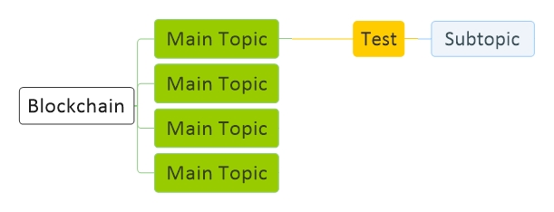

# [Crypto Currency BlockChain](CryptoCurrency.md)
[Diagram](CryptoCurrency-Diagram.md) | 
[Bitcoin](CryptoCurrency-Bitcoin.md) |
[Hash](CryptoCurrency-Hash.md) |
[Signature](CryptoCurrency-Signature.md) |
[Blockchain](CryptoCurrency-Blockchain.md) |
[Ethereum](CryptoCurrency-Ethereum.md)

<a href="#diagram">Diagram</a> - 
<a href="#resource">Resource</a> - 
<a href="#idioms">Idioms</a> - 
<a href="#structure">Structure</a> - 
<a href="#libreary">Libreary</a> - 
<a href="#command">Command</a> - 
<a href="#question">Question</a> - 
<a href="#source">Source</a>

## Diagram

## Resource

<a target="_blank" href="https://hackernoon.com/learn-blockchains-by-building-one-117428612f46">Write a blockchain</a> -

## Idioms
ثبت تاریخ به صورت زنجیروار

هر ۱۰ دقیقه یک بار یک ثبت یا بلاک در زنجیرهٔ بلاکچین اضافه می‌‌شود

انگیزهٔ هکر برای سرقت بالاست ولی‌ انگیزی سیستم بانکی‌ برای جلوگیری پایین است، هکر با هوش مصنوعی قویتر میشه

## Structure

بلاک چین زنجیری از بلاک هست، هر بلاک هش دیتای بلاک قبلی‌ رو دارد

## Libreary

## Command

## Question

1 -
 
2 - 
 
3 - 
 
4 - 
 
5 - 

## Source

    import json
    import hashlib
    import sys
    from time import time
    from flask import Flask, jsonify, request
    from uuid import uuid4

    class Blockchain: 

        def __init__(self):
            self.chain = []
            self.current_trxs = []
            self.new_block(previous_hash=1, proof=100)

        def new_block(self, proof, previous_hash=None):
            '''create a new block'''
            block = {
                'index' : len(self.chain) + 1,
                'timestamp' : time(),
                'trxs' : self.current_trxs,
                'proof' : proof,
                'previous_hash': previous_hash or self.hash(self.chain[-1])
            }
            self.current_trxs = []
            self.chain.append(block)
            return block

        def new_trx(self, sender, recipient, amount):
            '''add a new trx to the mempool'''
            self.current_trxs.append({'sender': sender, 'recipient': recipient, 'amount': amount})
            return self.last_block['index'] +  1

        @staticmethod
        def hash(block):
            '''hash a block'''
            block_string = json.dumps(block, soft_keys=True).encode()
            return hashlib.sha256(block_string).hexdigest

        @property
        def last_block(self):
            '''return last block'''
            return self.chain[-1]

        @staticmethod
        def valid_proof(last_proof, proof):
            ''' check if this proof is fine or not'''
            this_proof = f'{proof}{last_proof}'.encode()
            this_proof_hash = hashlib.sha256(this_proof).hexdigest()
            return this_proof_hash[:4] == '0000'

        def proof_of_work(self, last_proof):
            ''' shows that work is done '''
            proof = 0 
            while self.valid_proof(last_proof, proof) is False:
                proof += 1
                return proof

    app = Flask(__name__)

    node_id = str(uuid4())

    blockchain = Blockchain()

    @app.route('/mine')
    def mine():
        ''' this will mine one block and will add it to the chain '''
        last_block = blockchain.last_block
        last_proof = last_block['proof']
        proof = blockchain.proof_of_work(last_proof)
        blockchain.new_trx(sender="0", recipient=node_id, amount=50)

        previous_hash = blockchain.hash(last_block)
        block = blockchain.new_block(proof, previous_hash)

        res = {
            'message' : 'new block created',
            'index' : block['index'],
            'trxs' : block['trxs'],
            'proof' : block['proof'],
            'previous_hash' : block['previous_hash']
        }
        return jsonify(res), 200

    @app.route('/trxs/new', methods=['POST'])
    def new_trx():
        '''will add a new trx by getting sender, recipient, amount'''
        values = request.get_json()
        print(values)
        
        this_block=blockchain.new_trx(
            values['sender'], 
            values['recipient'], 
            values['amount']
        )
        res = {
            'message' : f'will be added to block {this_block}'
        }
        return jsonify(res), 201
        

    @app.route('/chain')
    def full_chain():
        '''return the full chain'''
        res = {
            'chain' : blockchain.chain,
            'length' : len(blockchain.chain),
        }
        return jsonify(res), 200

    if __name__ == '__main__':
        app.run(host='0.0.0.0', port=sys.argv[1])
