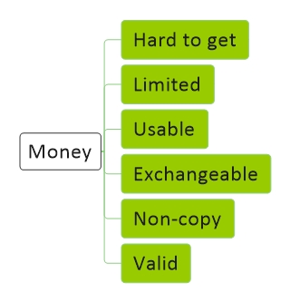
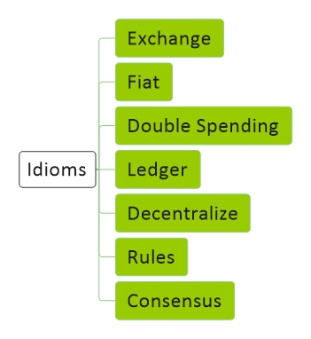
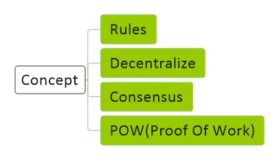
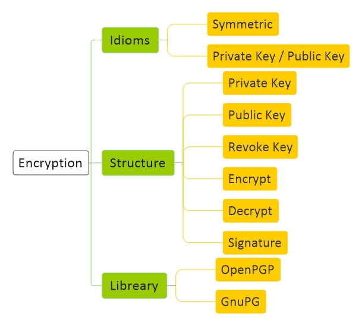

# [Crypto Currency Basic](file:./CryptoCurrency.md)
[Diagram](CryptoCurrency-Diagram.md) | 
[Basic](CryptoCurrency-Basic.md) |
[Hash](CryptoCurrency-Hash.md) |
[Encryption](CryptoCurrency-Encryption.md) |
[Blockchain](CryptoCurrency-Blockchain.md)

<a href="#general">General</a> - 
<a href="#money">Money</a> - 
<a href="#idioms">Idioms</a> -
<a href="#concept">Concept</a> -
<a href="#hashing">Hashing</a> -
<a href="#encryption">Encryption</a> - 
<a href="#blockchain">Blockchain</a> - 

## General

## Money

## Idioms

## Concept

## Hashing

## Encryption

## Blockchain

