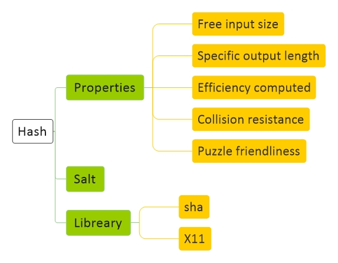

# [Crypto Currency Hash](file:./CryptoCurrency.md)
[Diagram](CryptoCurrency-Diagram.md) | 
[Bitcoin](CryptoCurrency-Bitcoin.md) |
[Hash](CryptoCurrency-Hash.md) |
[Signature](CryptoCurrency-Signature.md) |
[Blockchain](CryptoCurrency-Blockchain.md) |
[Ethereum](CryptoCurrency-Ethereum.md)

<a href="#diagram">Diagram</a> - 
<a href="#resource">Resource</a> - 
<a href="#structure">Structure</a> - 
<a href="#concept">Concept</a> - 
<a href="#libreary">Libreary</a> - 
<a href="#command">Command</a> - 
<a href="#script">Script</a> - 
<a href="#question">Question</a> - 

## Diagram

## Resource

hash break website

## Structure

Function 

## Concept

#### General

یک تابع که یک ورودی بگیرد و همیشه یک خرجی ثابت بابت این ورودی بدهد

چون خروجی‌ ثابت است و ورودی بی‌ نهایت، پس ۱۰۰ درصد ورودی‌های مختلف با خروجی یکسان خواهیم داشت، اما خروجی‌ اینقدر بزرگ که این مساله اصلا مهم نیست

#### Properties

Free input size

Specific output length

Efficiency computed

Collision resistance
&nbsp;&nbsp;&nbsp;&nbsp;&nbsp;
نتونن ورودی رو جوری تغییر بدن که به هش مورد نظرشون برسن

Hiding
&#8195;&#8195;&#8195;&#8195;&#8195;&#8195;&#8195;
نباید از هش به دیتا برسم

Puzzle friendliness
&nbsp;&nbsp;&nbsp;&nbsp;&nbsp;&nbsp;&nbsp;
خیلی سریع تولید نشه

#### Salt

## Libreary

sha256

## Command

    echo hello | sha256sum

## Script

    import hashlib

    for i in range(1,1000000):

        data='my name is jadi and my 123456 is my student number. ' + str(i)
        m = hashlib.sha256()
        m.update(data.encode('utf-8'))
        hash = m.hexdigest()

        if hash[-4:] == "1111" :
            print('found it ',i, data)
            break

## Question

1 -
 
2 - 
 
3 - 
 
4 - 
 
5 - 