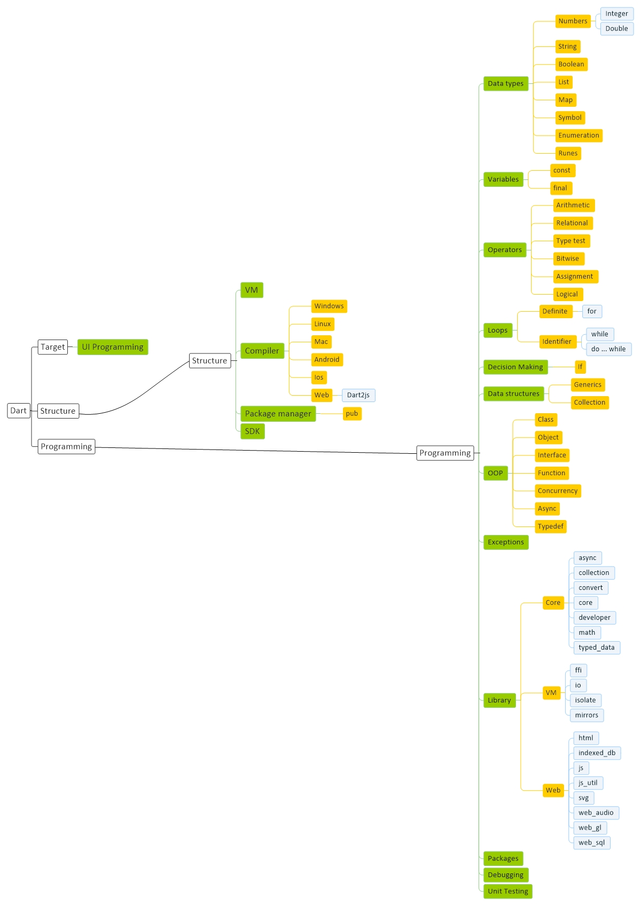

# [Dart Basic](Dart.md)
[Basic](Dart-Basic.md) | [Programming](Dart-Programming.md) | [Script](Dart-Script.md)

## Resource
#### General
<a href="https://dart.dev/" target="_blank">Dart</a> - 
<a href="https://github.com/dart-lang" target="_blank">Github</a> - 
<a href="https://pub.dev" target="_blank">Pub</a> - 
<a href="https://dartpad.dev/" target="_blank">Dartpad</a> 

#### Learn
<a href="https://welearn.site/course/flutter-video-tutorial/" target="_blank">welearn</a> -
<a href="https://toplearn.com/courses/2213/%D8%A2%D9%85%D9%88%D8%B2%D8%B4-%D8%B2%D8%A8%D8%A7%D9%86-dart" target="_blank">toplearn</a> -
<a href="https://pvlearn.com/product/learn-dart/" target="_blank">pvlearn</a> -
<a href="https://git.ir/packtpub-dart-2-in-7-days/" target="_blank">git</a> -
<a href="https://faradars.org/search_gcse?q=dart&cse_blog=1" target="_blank">faradars</a> -

## Setup

#### Download
<a href="https://dart.dev/tools/sdk/archive" target="_blank">SDK</a>

#### Config
Add dart_sdk adress into PATH system variable : D:\Programming\dart_sdk

## SDK

## VM

## Compiler

## Package manager

## Question
1 - override method of class when inisialz a object of class
 
2 - different with stateless widget and materoal app when send to runapp()
 
3 - different between const and final
 
4 - Dart Type Casting or inisialz object after getting from method of a class
 
5 - Defference between collection and generic