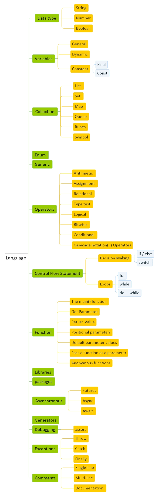

# [Dart Diagram](Dart.md)
[Diagram](Dart-Diagram.md) | 
[Basic](Dart-Basic.md) | 
[Language](Dart-Language.md) | 
[Development](Dart-Development.md) | 
[Script](Dart-Script.md)

<a href="#general">General</a> - 
<a href="#language">Language</a> -
<a href="#development">Development</a> -
<a href="#tools">Tools</a>

## General

## Language

## Development

## Tools

