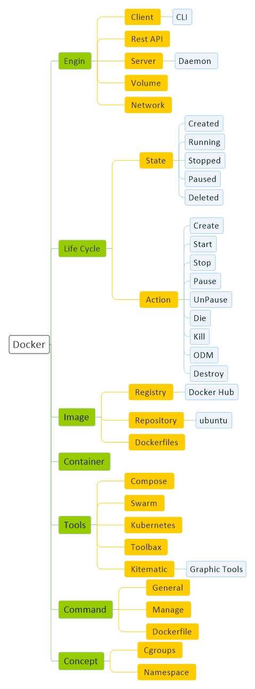

# [Docker Basic](Docker.md)
[Basic](Docker-Basic.md) | 
[Structure](Docker-Structure.md) | 
[Command](Docker-Command.md) |
[Script](Docker-Script.md)

<a href="#Resource">Resource</a> - 
<a href="#Install">Install</a> - 
<a href="#Tools">Tools</a> - 
<a href="#Concept">Concept</a>

## Resource

#### General

<a href="https://www.docker.com/" target="_blank">docker</a> - 
<a href="https://hub.docker.com/" target="_blank">docker hub</a> - 

#### Tutorial

<a href="https://dockerme.ir/" target="_blank">dockerme</a> -

## Install

#### Ubuntu
    
    sudo apt remove docker docker-engine docker.io containerd runc

    sudo apt update
    sudo apt install apt-transport-https ca-certificates curl gnupg-agent software-properties-common
    curl -fsSL https://download.docker.com/linux/ubuntu/gpg | sudo apt-key add -
    sudo add-apt-repository "deb [arch=amd64] https://download.docker.com/linux/ubuntu $(lsb_release -cs) stable"
    sudo apt update
    sudo apt install docker-ce docker-ce-cli containerd.io

    sudo usermod -aG docker morteza
    
#### Centos

## Tools

<table class="tbl1"><tbody>
<tr>
<td align="center" id="header">Tools</td>
<td align="center" id="header">Description</td>
</tr>
<tr>
<td align="center">Compose</td>
<td align="center">با این ابزار میتوان چندین کانتینر را اجرا کرد</td>
</tr>
<tr>
<td align="center">Swarm</td>
<td align="center"></td>
</tr>
<tr>
<td align="center">Kubernetes</td>
<td align="center"></td>
</tr>
<tr>
<td align="center">Toolbax</td>
<td align="center"></td>
</tr>
<tr>
<td align="center">Machin</td>
<td align="center"></td>
</tr>
<tr>
<td align="center">Kitematic</td>
<td align="center">Graphic Tools</td>
</tr>
</tbody></table>

## Concept

 
 
 

