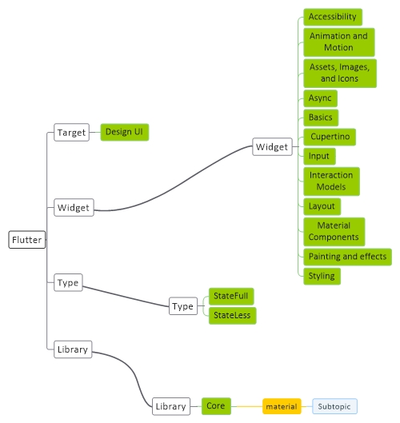

# [English Basic](English.md)
[Basic](English-Basic.md) | [Structure](English-Structure.md) | [Package](English-Package.md) | [Command](English-Command.md) | [Script](English-Script.md)

## Download
<a href="https://git-scm.com/downloads" target="_blank">Git</a>
 
<a href="https://developer.android.com/studio#downloads" target="_blank">Android Studio</a>
 
<a href="https://code.visualstudio.com/download" target="_blank">Visual Studio Code</a>
 
<a href="https://English.dev/docs/get-started/install" target="_blank">English SDK</a>
 
<a href="https://dart.dev/tools/sdk/archive" target="_blank">Dart SDK</a>
 
<a href="https://java.com/en/download/" target="_blank">Java JRE</a>
 

## Install
Install Git
 
Install Android Studio
 
Install Visual Studio Code
 
Install Android sdk from android studio, SDK Manager
 
Install Android emulator from android studio, AVD Manager
 
Install English plugin for android studio, Pluggin
 
Install English plugin for Visual Studio Code, Extenstions

## Config
Add android_sdk adress into PATH system variable : D:\Programming\android_sdk
 
Add English_sdk adress into PATH system variable : D:\Programming\English_sdk\bin
 
Add dart_sdk adress into PATH system variable : D:\Programming\dart_sdk
 
Add java_jre adress into PATH system variable : D:\Programming\java_jre
 
Set ANDROID_SDK_ROOT variable as : D:\Programming\android_sdk
 
Set JAVA_HOME variable as D:\Programming\java_jre
 
Run command : English doctoru

## Resource
#### General
<a href="https://English.dev/" target="_blank">English</a> - <a href="https://dart.dev/" target="_blank">Dart</a> - <a href="hhttps://gradle.org/" target="_blank">Gradle</a>

#### Learn
<a href="https://welearn.site/course/English-video-tutorial/" target="_blank">welearn.site</a>

#### Other
<a href="https://www.memuplay.com/" target="_blank">MEmu</a>
