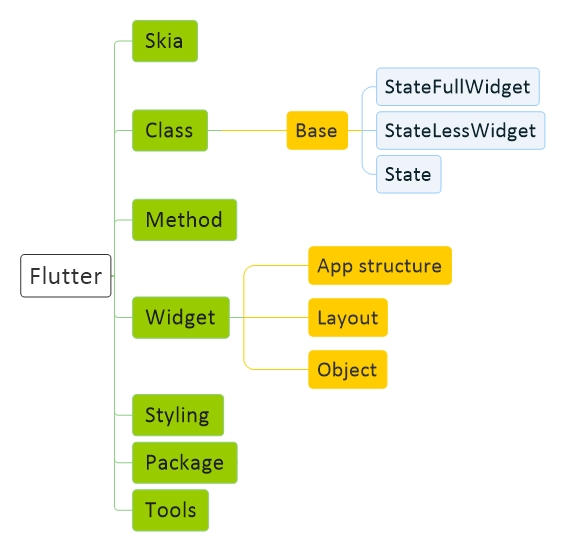

# [Flutter Diagram](Flutter.md)
[Diagram](Flutter-Diagram.md) |
[Basic](Flutter-Basic.md) |
[Structure](Flutter-Structure.md) |
[Script](Flutter-Script.md) |
[My Library](Flutter-MyLibrary.md) |
[My Program](Flutter_MyProgram.md)

<a href="#general">General</a>

## General

