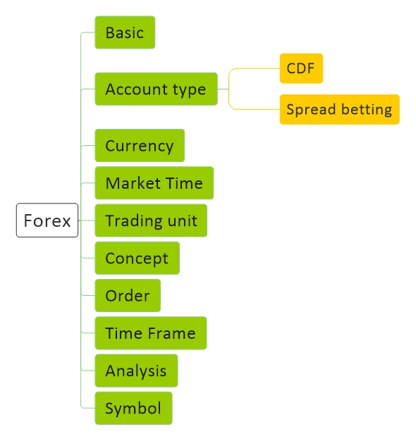

# [Forex Basic](Forex.md)
[Basic](Forex-Basic.md) | [Concept](Forex-Concept.md) | [Script](Forex-Script.md)

## Resource
#### General
<a href="https://www.ig.com/en" target="_blank">IG</a> - 
<a href="https://www.fxcm.com/uk/" target="_blank">Fxcm</a> - 
<a href="https://tradingstation.fxcm.com/FreeDemo?lc=en_US" target="_blank">Fxcm tradingstation</a>
#### Developer
<a href="https://www.mql5.com/en" target="_blank">mql5</a> - 
<a href="https://github.com/fxcm" target="_blank">fxcm</a> - 
<a href="https://github.com/FXCMAPI" target="_blank">FXCMAPI</a>
#### Learn
<a href="https://fxcmpy.tpq.io/" target="_blank">fxcmpy</a>

## Question
1 - -------
 
2 - ------