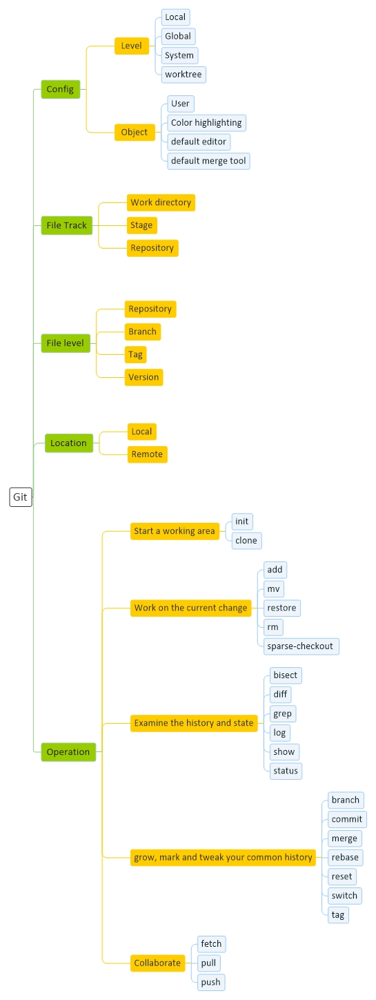

# [Git Basic](Git.md)
[Basic](Git-Basic.md) | 
[Structure](Git-Structure.md) | 
[Script](Git-Script.md)

## Resource

git-scm.com   gitlab.com   github.com 

## Tutorial

faradars.org   roocket.ir   toplearn.com   clicksite.org   faranesh.com

## Tools

Ohmyzsh  گرافیک git

## Concept

گیت یک مخزن (repository) می سازه که از سه لایه منطقی به فایل ها نگاه میکنه :
 
1 – لایه اول یا همان (working tree) که هنوز اقدامی برای ثبت تغییرات انجام نشده و فایل ها در حال تغییر هستند 
 
2 – لایه دوم یا همان (stage)که با وارد کردن فایل ها به این لایه، آنها آماده ثبت تغییر می شوند
 
3 – لایه سوم (Repository) که تمام تغییرات فایل ها ثبت می شوند

 

fork کردن در واقع یعنی یه کپی از پروژه گرفتن و تغییر دادنش
 
میشود از سازندش در خواست کرد تغیییرات رو ببینه و با پروژه اصلی خودش مرج کنه

