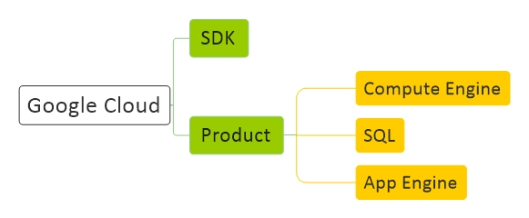

# [Google Basic](Google.md)
[Basic](Google-Basic.md) | 
[Product](Google-Product.md) | 
[Script](Google-Script.md)

## Resource
#### General
<a href="https://cloud.google.com/" target="_blank">Google Cloud</a>

## Question
1 - -------
 
2 - ------