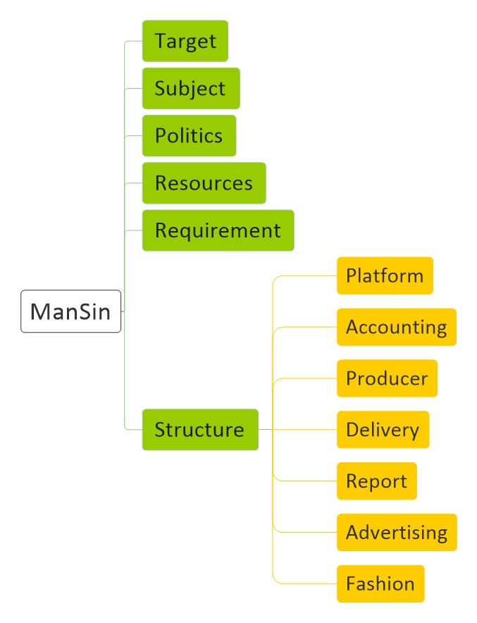

# [ManSin Basic](ManSin.md)

[Basic](ManSin-Basic.md) |
[Target](ManSin-Target.md) |
[Subject](ManSin-Subject.md) | 
[Politics](ManSin-Politics.md) |
[Resources](ManSin-Resources.md) | 
[Requirement](ManSin-Requirement.md) | 
[Structure](ManSin-Structure.md)

