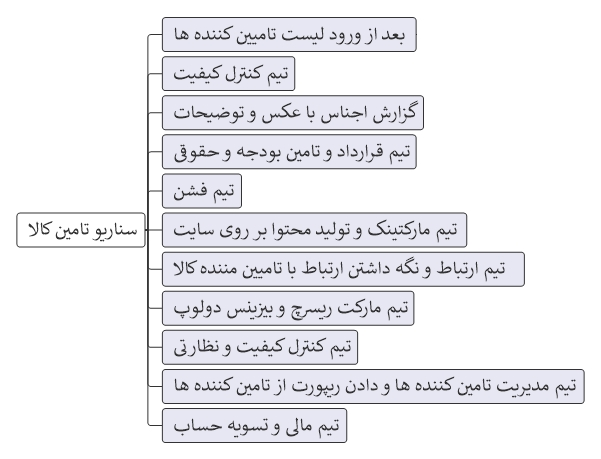
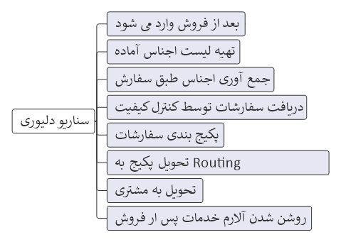

# [ManSin Scenario](ManSin.md)

[Basic](ManSin-Basic.md) |
[Target](ManSin-Target.md) |
[Strategy](ManSin-Strategy.md) |
[Resources](ManSin-Resources.md) | 
[Requirement](ManSin-Requirement.md) |
[Scenario](ManSin-Scenario.md)

<a href="#کالا">کالا</a> - 
<a href="#دلیوری">دلیوری</a>

## کالا

## دلیوری

