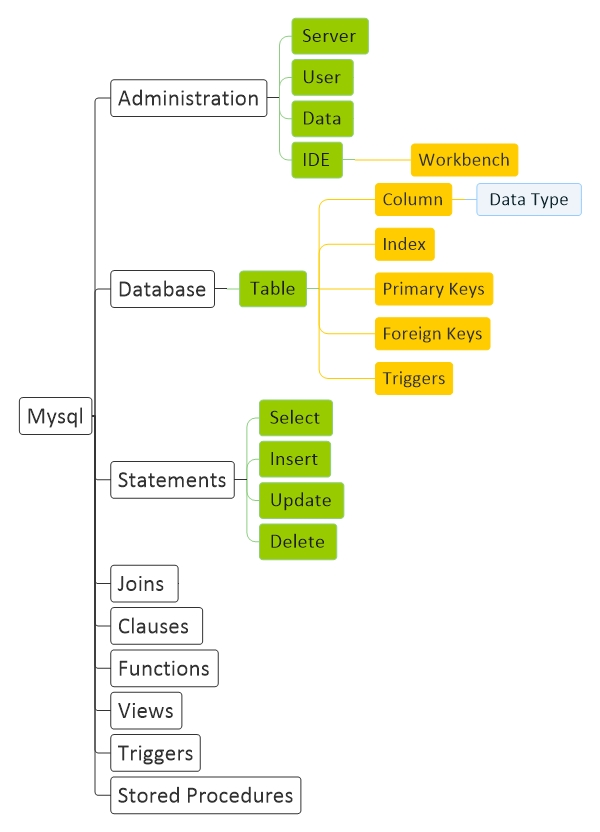

# [Mysql Basic](Mysql.md)

[Basic](Basic.md) | 
[Structure](Structure.md) | 
[Command](Command.md)

<a href="#resource">Resource</a> - 
<a href="#install">Install</a> - 
<a href="#config">Config</a> - 
<a href="#question">Question</a> 

## Diagram

## Resource

#### General
<a href="https://www.mysql.com/" target="_blank">mysql</a>

#### Learn
<a href="https://www.tutorialspoint.com/mysql/index.htm" target="_blank">tutorialspoint</a> - 
<a href="https://www.w3schools.com/sql/" target="_blank">w3schools</a> - 
<a href="https://www.quackit.com/mysql/tutorial/" target="_blank">quackit</a>

## Install

#### Windows

    Add This address into PATH user variable : C:\Program Files\MySQL\MySQL Server 8.0\bin
    

    mysqladmin --version
    

    mysql -u root -p

#### Ubuntu

    sudo apt install mysql-server

    sudo apt remove --purge mysql*

## Config

#### Ubuntu

    security script 
    ---------------
    sudo mysql_secure_installation

    Network  
    ------------------------------------------
    sudo vim /etc/mysql/mysql.conf.d/mysqld.cnf

    [mysql]
    bind-address            = 0.0.0.0

    Service
    ------------
    sudo service mysql status
    sudo service mysql restart

    sudo systemctl status mysql
    sudo systemctl restart mysql

    netstat -na | grep 3306

    Firewall
    ---------------
    sudo ufw enable
    sudo ufw allow mysql

## Question

