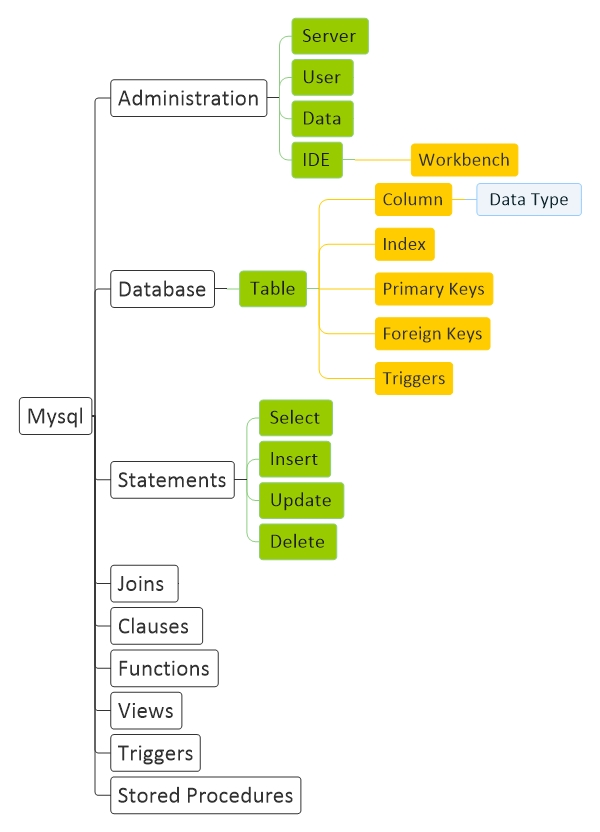

# [Mysql Basic](Mysql.md)
[Basic](Mysql-Basic.md) | [Structure](Mysql-Structure.md) | [Script](Mysql-Script.md)

## Resource

#### General
<a href="https://www.mysql.com/" target="_blank">mysql</a>

#### Learn
<a href="https://www.tutorialspoint.com/mysql/index.htm" target="_blank">tutorialspoint</a> - 
<a href="https://www.w3schools.com/sql/" target="_blank">w3schools</a> - 
<a href="https://www.quackit.com/mysql/tutorial/" target="_blank">quackit</a>

## Install
Add This address into PATH user variable : C:\Program Files\MySQL\MySQL Server 8.0\bin

mysqladmin --version

mysql -u root -p

## Question
1 - aaaaaaaa
 