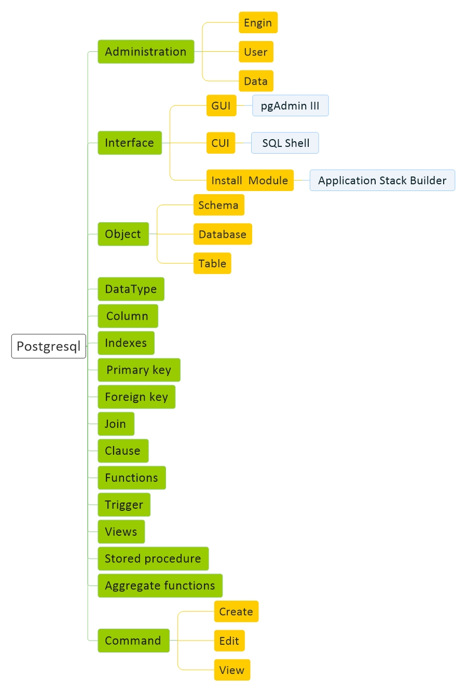

# [ Postgresql Basic]( Postgresql.md)
[Basic]( Postgresql-Basic.md) | 
[Structure]( Postgresql-Structure.md) | 
[Script]( Postgresql-Script.md)

<a href="#Resource">Resource</a> - 
<a href="#Install">Install</a> - 
<a href="#Question">Question</a> 

## Resource

#### General

<a href="https://www. Postgresql.com/" target="_blank"> Postgresql</a>

#### Learn

<a href="https://www.tutorialspoint.com/ Postgresql/index.htm" target="_blank">tutorialspoint</a> - 
<a href="https://www.w3schools.com/sql/" target="_blank">w3schools</a> - 
<a href="https://www.quackit.com/ Postgresql/tutorial/" target="_blank">quackit</a>

## Install

#### Windows

    Add This address into PATH user variable : C:\Program Files\ Postgresql\ Postgresql Server 8.0\bin

#### Ubuntu

    wget --quiet -O - https://www.postgresql.org/media/keys/ACCC4CF8.asc | sudo apt-key add -
    sudo sh -c 'echo "deb http://apt.postgresql.org/pub/repos/apt/ `lsb_release -cs`-pgdg main" >> /etc/apt/sources.list.d/pgdg.list'
    sudo apt update
    sudo apt install postgresql postgresql-contrib

#### Centos

## Question

1 - aaaaaaaa
 