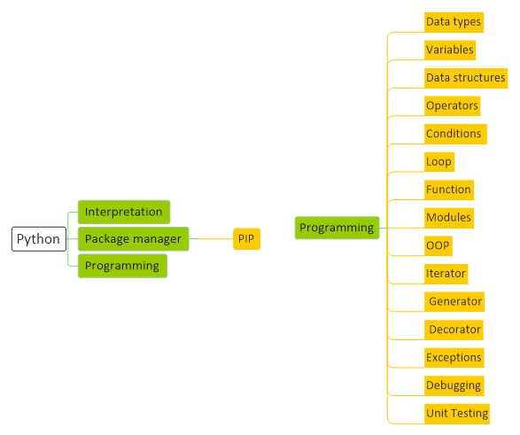

# [Python Basic](Python.md)
[Basic](Python-Basic.md) |
[Structure](Python-Structure.md) | 
[Script](Python-Script.md)

<a href="#Resource">Resource</a> - 
<a href="#Install">Install</a> - 
<a href="#Interpretation">Interpretation</a> - 
<a href="#package-manager">Package manager</a> - 
<a href="#Question">Question</a>  

## Resource

#### General

<a href="https://www.python.org/" target="_blank">Python</a> - 
<a href="https://pypi.org/" target="_blank">pypi</a> - 
#### Learn
<a href="https://docs.python.org/3/" target="_blank">Python Doc</a> - 
<a href="https://docs.python.org/3/" target="_blank">python</a> - 
<a href="https://www.py4e.com/lessons" target="_blank">py4e</a> - 
<a href="https://www.learnpython.org/" target="_blank">learnpython</a> - 
<a href="https://www.tutorialspoint.com/python/index.htm" target="_blank">tutorialspoint</a> - 
<a href="https://www.w3schools.com/python/" target="_blank">w3schools</a> - 
<a href="https://www.quackit.com/python/tutorial/" target="_blank">quackit</a> - 
<a href="https://toplearn.com/courses/2150/%D8%A2%D9%85%D9%88%D8%B2%D8%B4-%D8%B1%D8%A7%DB%8C%DA%AF%D8%A7%D9%86-%D9%BE%D8%A7%DB%8C%D8%AA%D9%88%D9%86-(-python-)" target="_blank">toplearn</a>

#### Tools

<a href="https://jsonplaceholder.typicode.com/" target="_blank">jsonplaceholder</a>

## Install

#### Windows

	Download file and Install it	

#### Ubuntu	

	sudo add-apt-repository ppa:deadsnakes/ppa
	sudo apt update
	sudo apt install python3.8
	sudo apt install python3-pip	

#### Config Editor

	Install Visual Studio Code		
	Install Python, autopep8, Material Icon Theme
	Add This address into PATH user variable : D:\Programming\python_sdk\	
	Add This address into PATH user variable : D:\Programming\python_sdk\Scripts\

## Interpretation
	python3.8 --version

#### Package manager
	pip --version
	
	pip install -U pylint --user

## Question
1 - فانکشنی هست که object بصورت ورودی میگیرد این یعنی چی؟

	class range(object):
