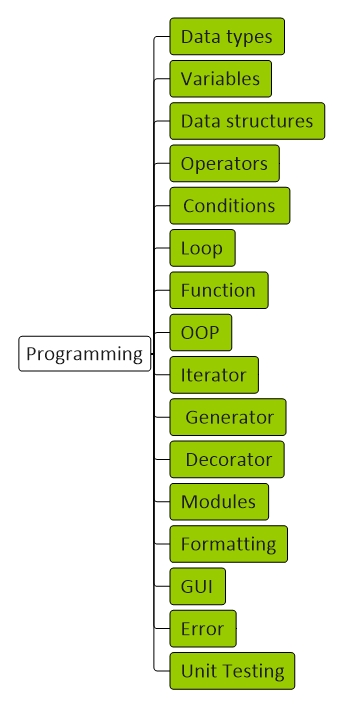

# [Structure](Index.md)

[Basic](Basic.md) |
[Structure](Structure.md) | 
[Script](Script.md) | 
[Script](Flask.md)

<a href="#data-type" >Data Type</a> - 
<a href="#Variable" >Variable</a> - 
<a href="#data-structures" >Data structures</a> - 
<a href="#Operators">Operators</a> - 
<a href="#Conditions">Conditions</a> - 
<a href="#loop">Loop</a> - 
<a href="#function" >Function</a> -
<a href="#module">Module</a> -
<a href="#API">API</a> -
<a href="#Database">Database</a> -
<a href="#Error">Error</a>

<a href="#oop" >OOP</a> -
<a href="#Iterator">Iterator</a> - 
<a href="#Generator">Generator</a> - 
<a href="#decorator">Decorator</a> -
<a href="#Example">Example</a>

<a href="#socket">Socket</a> -
<a href="#multi-processing">Multi Processing</a> -
<a href="#multi-threading">Multi Threading</a> - 
<a href="#syncasync">Sync/Async</a>

## Diagram

## Data types
#### String
#### Numeric : Integer , Float 
#### Boolean
#### Complex
#### Binary
#### Convert Data Type

## Variable

#### Variable Assignment

#### Name mangling 

## Data structures 

#### List	

#### Dictionary

#### Tuple	

بعد از پیاده سازی دیگر قابل تغییر نیستند
  
سرعت بسیار بیشتری از لیست دارد

#### Set

آیتم تکراری نمی پذیرد و همچنین ترتیب ندارد و دسترسی بر اساس index امکانپذیر نیست 

#### Range

#### frozenset	
	
	
	

## Operators 
#### Arithmetic 
#### Comparison
#### Logical 
#### Assignment 
#### Bitwise 
#### Ternary

## Conditions  
#### IF Statement
#### Expression
#### Truthiness and Falsiness

## Loop 
#### For
#### While

## Function 
#### normal function
#### function With Return Value	
#### function With parameters	
#### function With Default parameter values	
#### function With Definition parameters
#### function With dynamic parameters
#### Anonymous functions(lambda)
#### Built-in function(Map, filter, all, any, sort, reversed, max-min , Len , Abs , Sum و Round , zip)

اگر در ورودی فانکشن از args* استفاده کنیم یعنی مهم نیست فانکشن رو با یک ورودی صدا کردی یا 100 تا
  
اگر در ورودی فانکشن از kwarg* استفاده کنیم تمام ورودی را بصورت یک دیکشنری می گیرد

## OOP
#### Abstraction
#### Encapsulation
#### Class, Object
#### Method, Constructor
#### Attribute, Property , Setter  , Getter
#### Inheritance , Super , multiple inheritance, Method resolution order
#### Polymorphisms

## Iterator

پیاده سازی این مفهوم برای پیمایش دیتا کاربرد دارد
  
حلقه های تکرار از همین مفهوم استفاده می کنند
  
با پیاده سازی این مفهوم میتوانیم بر روی کلاس های خود با حلقه های تکرار پیمایش کنیم
  
مناسب برای کار با big data
  
Iterable : کلاس هایی مثل List که امان اضافه کردن آیتم را دارند 
  
Iterator : کلاسی که با متد()iter قابل پیمایش  شده است 
  
Iterate : هر یک از آیتم ها که پیمایش می شود 
  
با متد ()iter کلاس های Iterable تبدیل به Iterator می شوند
  
آیتم های یک Iterator با متد ()next پیمایش می شوند

## Generator

هر Generator یک Iterator است
   
میتوان متد هایی ایجاد کرد که استیت متد نگه داشته شود و با اجرای هر بار متد ()next استیت تغییر کند
  
برای کار با دیتاهای عظیم و امثالی مثل فیبوناچی با این روش خیلی بهتر انجام میشه
  
یک فانکشن معمولی که به جای return از yield استفاده می شود

## Decorator

 پیاده سازی این مفهوم این امکان را به ما می دهد که ماهیت یک فانکشن را تغییر و توسعه بدهیم
   
 decorator تابعی است، که تابع دیگر را دریافت می‌کند و رفتار آن را تغییر می‌دهد 

## Socket

## Multi Processing

## Multi-Threading

## Sync/Async

Blocking 

Non Blocking

یک تابع آسنکرون در داخل پایتون Coroutine نامیده میشه

این دو، توابع خاصی هستن که وقتی صدا زده بشن آبجکتی به نام coroutine object رو بر می گردونن

process
thread
task

## Socket

## Error

#### Debugging

#### Return raise

#### try except

## API

pip install request

