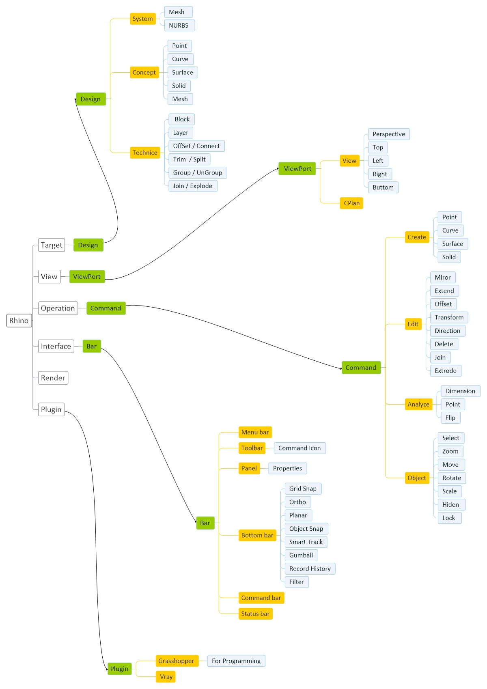

# [Rhino Basic](Rhino.md)
[Basic](Rhino-Basic.md) | [Concept](Rhino-Concept.md) | [Setting](Rhino-Setting.md) | [Note](Rhino-Note.md) | [Create](Rhino-Command-Create.md) | [Change Position](Rhino-Command-ChangePosition.md) | [Change Object](Rhino-Command-ChangeObject.md) | [Analyze](Rhino-Command-Analyze.md)

## Info
